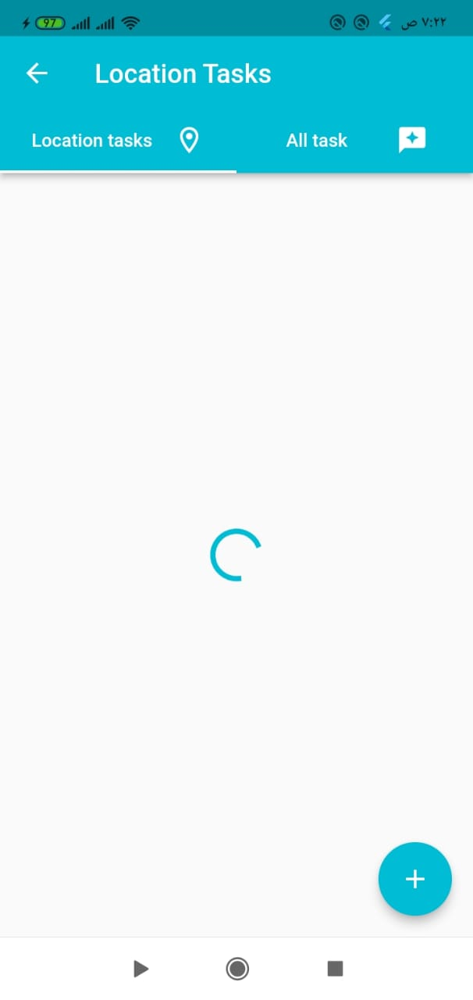
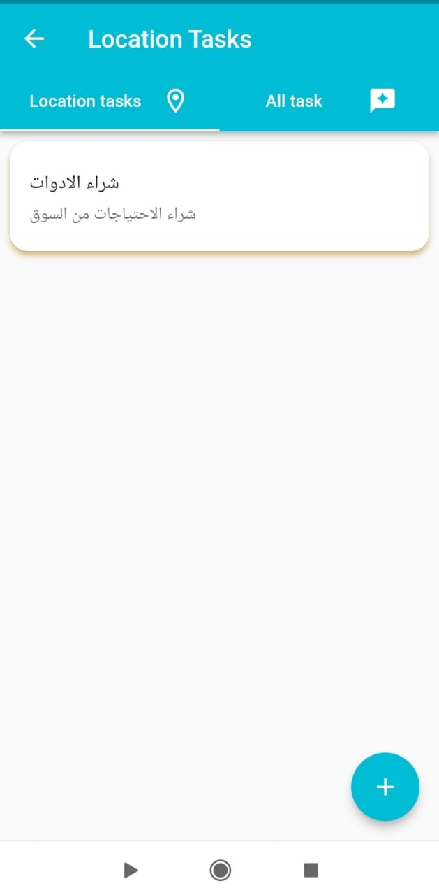
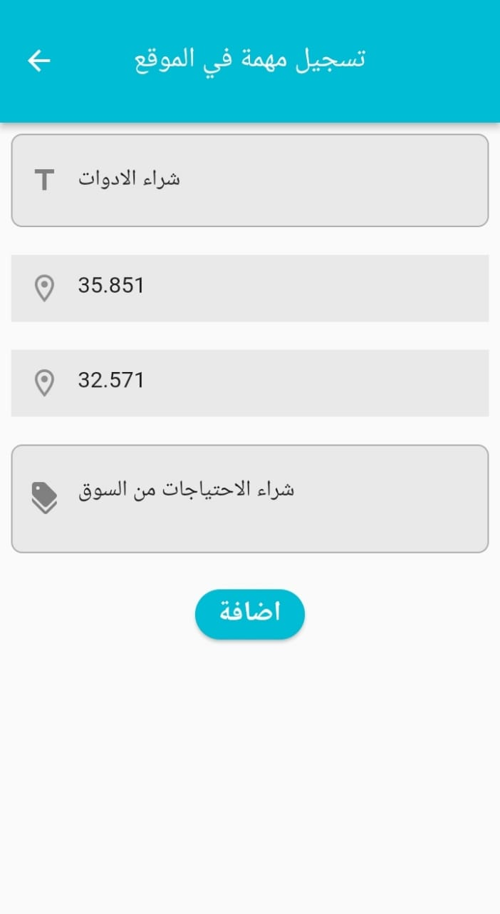
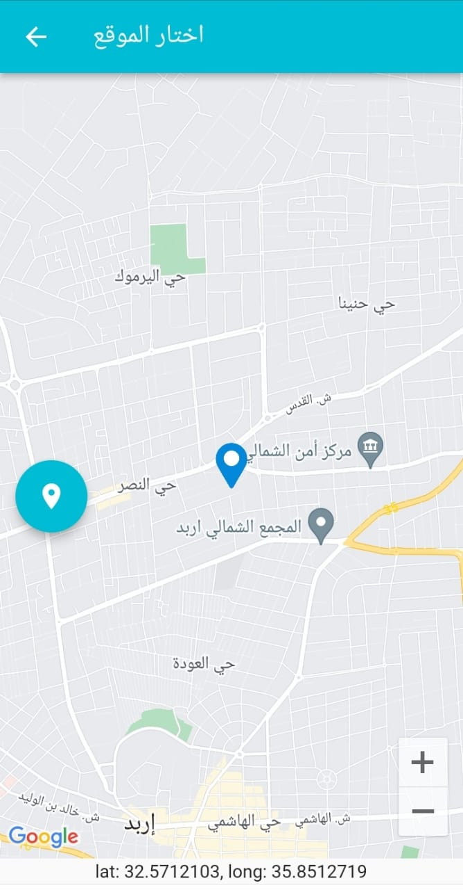
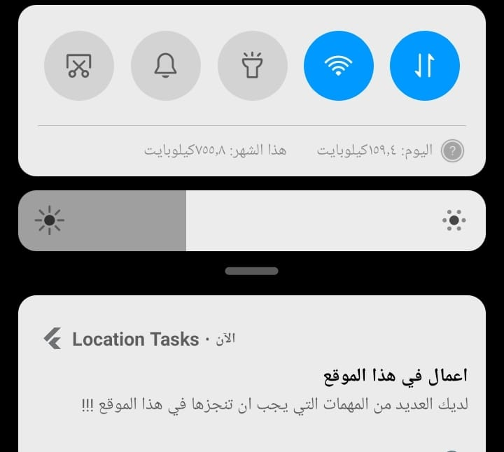

# Hi, In Location Takes  👋
# Location Takes
Location Takes it is application to remind the user with tha tasks that the user should do  it in each location store in the app.
## Possess flow
- The user  should  add the tasks that the user would like to do it in the specific location
- The app will load all task and The task on current location
- The app will send notifications in case there any tasks in  user current location
- The user can delete the tasks after do it in location 

## Screenshots

 Home page 

 
 

Find the tasks in current location

  
 

 Retrieve the Location tasks

  
 

 Add the data of the task

  
 

  Take the location of new task 

  
 

 Notify the user about the takes in the location

  
 

 [apk](./assets/app-debug.apk)
